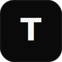

<p align="center">
  
</p>

<h1 align="center">Толк.</h1>

<p align="center">
  <strong>Минималистичный мессенджер</strong> для русскоязычного комьюнити.<br/>
  Быстрый · чистый · свой — без tab-bar ×5 и без клонирования MAX.
</p>

<p align="center">
  <strong>Русский</strong> · <a href="README.en.md">English</a>
</p>

<p align="center">
  <a href="#быстрый-старт"></a>
  <a href="#навигация"></a>
  <a href="https://github.com/etern1ty-crypto/tolk-back"></a>
  <a href="vault/"></a>
  <a href="LICENSE"></a>
</p>

---

## Идея

| | |
|---|---|
| **Чаты** | Home. Текст, войсы, кружки, реакции |
| **Стена** | Лента постов (лайк · коммент · репост в профиль · переслать) |
| **Профиль** | Оформление, посты, «добавить в стену», настройки |

Дифференциаторы без шума: **Стена**, **Echo** (тихо), **Полка** (закрепы *в* чате).
Визуал: **монохром**, hairline-лента (как X), иконки **lucide**.

Полный продукт-концепт → [`vault/Tolk_Core_Concept.md`](vault/Tolk_Core_Concept.md) · IA → [`vault/Navigation_IA.md`](vault/Navigation_IA.md)

---

## Что это за репозиторий

Это **клиент** (веб-приложение) и **продуктовый vault**. Серверная часть — HTTP API и
WebSocket-шлюз — живёт в отдельном репозитории [**tolk-back**](https://github.com/etern1ty-crypto/tolk-back).

| Репозиторий | Роль |
|---|---|
| **tolk** (этот) | Веб-клиент `apps/web` + продуктовый vault |
| [**tolk-back**](https://github.com/etern1ty-crypto/tolk-back) | API + WebSocket + Postgres · Redis · S3 |

---

## Структура репозитория

```text
tolk/
├── apps/
│   └── web/                 # Vite + React + TS · основной клиент
├── packages/
│   └── protocol/            # Общие контракты WS/REST (зеркало из tolk-back)
├── vault/                   # Obsidian source of truth (продукт)
├── docs/                    # Инженерные заметки, walkthrough, assets
├── package.json             # root scripts → apps/web
└── README.md
```

> В корне также лежит legacy Expo scaffold (ранний RN-эксперимент).
> **Актуальный UI — `apps/web`.**

---

## Быстрый старт

```bash
# Node 20+
cd apps/web
npm install
npm run dev
```

Открой `http://127.0.0.1:5173`

Из корня репозитория:

```bash
npm run dev      # то же, что apps/web
npm run build
npm run preview
```

### Подключение к бэкенду

Клиент работает с реальным API из [tolk-back](https://github.com/etern1ty-crypto/tolk-back).
Без переменных окружения он ходит на `http://localhost:3000` и WS `/ws` того же origin —
то есть достаточно поднять `tolk-back` локально. Чтобы указать другой адрес, создай
`apps/web/.env.local`:

```bash
# apps/web/.env.local
VITE_API_URL=http://localhost:3000        # базовый URL API
VITE_WS_URL=ws://localhost:3000/ws        # WebSocket-шлюз
VITE_YANDEX_CLIENT_ID=                    # опц. вход через Яндекс ID
VITE_VK_CLIENT_ID=                        # опц. вход через VK ID
```

> Кнопки соц-входа появляются, только если заданы соответствующие `CLIENT_ID`.
> Иначе доступен вход по username/паролю.

### Демо друзьям (Cloudflare Tunnel)

```bash
# терминал 1
cd apps/web && npm run dev -- --host 127.0.0.1 --port 5173

# терминал 2
cloudflared tunnel --url http://127.0.0.1:5173
```

В `vite.config.ts` включён `allowedHosts: true` для `*.trycloudflare.com`.

---

## Навигация

```text
┌──────────┬──────────┬──────────┐
│  Стена   │  Чаты ★  │ Профиль  │
└──────────┴──────────┴──────────┘
     │           │          │
   лента      list→chat   посты + ⚙
```

**Demo path:** login → чат → reply / реакция / войс / кружок → стена → профиль → settings.

Подробнее: [`docs/walkthrough.md`](docs/walkthrough.md)

---

## Стек (web)

| Слой | |
|---|---|
| UI | React 19 · TypeScript · Vite |
| Роутинг | react-router-dom |
| State | Zustand (+ persist) |
| Медиа | browser-image-compression |
| Icons | lucide-react (stroke 1.75) |
| Style | CSS Modules · monochrome tokens |
| Realtime | WebSocket → [tolk-back](https://github.com/etern1ty-crypto/tolk-back) |

Auth: username/пароль + опциональный вход через Яндекс ID и VK ID.

---

## Obsidian vault

Папка [`vault/`](vault/) — зеркало live-vault (`Documents/tolk/tolk`).

Рекомендуется открывать в Obsidian как vault:

1. Obsidian → Open folder as vault → `…/tolk/vault`
2. Читать старт: `Tolk_Core_Concept` → `MVP` → `Navigation_IA` → `For_Developers`

Ключевые заметки:

| Note | О чём |
|---|---|
| [`Navigation_IA`](vault/Navigation_IA.md) | 3 вкладки — основа |
| [`User_Wall`](vault/User_Wall.md) | Стена = лента |
| [`Chat_Shelf`](vault/Chat_Shelf.md) | Полка чата ≠ стена |
| [`Living_Profiles`](vault/Living_Profiles.md) | Профиль |
| [`Visual_Language`](vault/Visual_Language.md) | Ч/б UI |
| [`MVP`](vault/MVP.md) | Scope |

---

## Дизайн

- **Чёрный фон** `#000`, текст `#F5F5F5`
- Primary CTA — белая pill-кнопка
- Стена/профиль: **hairline dividers**, без «карточек»
- Без цветных акцентов (mint/ice сняты)

---

## Backend & mobile

| Ссылка | |
|---|---|
| [**tolk-back**](https://github.com/etern1ty-crypto/tolk-back) | Серверная часть: API + WebSocket + Postgres/Redis/S3 |
| [`packages/protocol`](packages/protocol) | Общие контракты WS/REST |
| [`docs/MOBILE_PREP.md`](docs/MOBILE_PREP.md) | Готовность к iOS / Android (Expo) |

## Roadmap (коротко)

- [x] Web shell · 3 вкладки · happy path
- [x] Стена / профиль / чаты / Echo / полка (UI)
- [x] Desktop shell + ambient patterns
- [x] Реальный API + WebSocket ([tolk-back](https://github.com/etern1ty-crypto/tolk-back))
- [x] Загрузка медиа / войсы и кружки
- [ ] Expo-клиент (`apps/mobile`) iOS + Android

---

## Лицензия

[MIT](LICENSE) — см. файл в корне.

---

<p align="center">
  <sub>Толк. — продукт, в котором есть толк.</sub>
</p>
