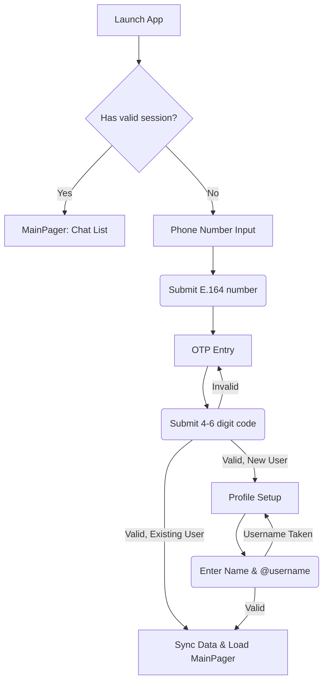

# Auth & Sessions Flow (Tolk)

## 1. Authentication User Flow (Mermaid)

## 2. Logout & Session Wipe Rules

### "Logout" (Current Device)
1. **Trigger**: User navigates to `Settings -> Logout`.
2. **Action**: Prompt for confirmation.
3. **Execution**:
   - Invalidate local session tokens.
   - Wipe local SQLite DB completely (messages, chats, profile data must not remain on the device).
   - Clear MMKV (preferences, outbox).
   - Navigate user back to `AuthPhoneScreen`.
4. **Outbox policy**: Best-effort sync before wiping. If offline, unsent messages are lost to prevent data leaks to subsequent device users.

### "Logout All Other Devices"
1. **Trigger**: User navigates to `Settings -> Devices -> Terminate All Others`.
2. **Action**: Prompt for confirmation ("Requires OTP to log in again on other devices").
3. **Execution**:
   - Send revocation request to server for all refresh tokens except the current one.
   - Other devices receive a force-logout push/websocket event.
   - On receiving force-logout, those devices execute the local wipe process described above.

## 3. Profile & Account Hygiene
- **Account Deletion**: Requires a multi-step confirmation (e.g., OTP or typing username). Triggers soft-delete on server, releases username after a delay, revokes all sessions, and wipes local DB.
- **Permissions during Auth**: 
  - Do NOT ask for all permissions immediately.
  - Push tokens are registered only after permission is explicitly granted (e.g., soft prompt in chat list).
  - Contacts sync is opt-in via "Find Friends" later, not blocking the onboarding flow.
